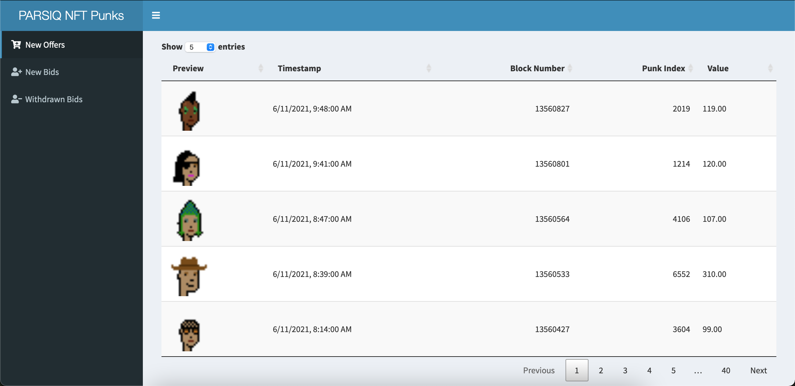
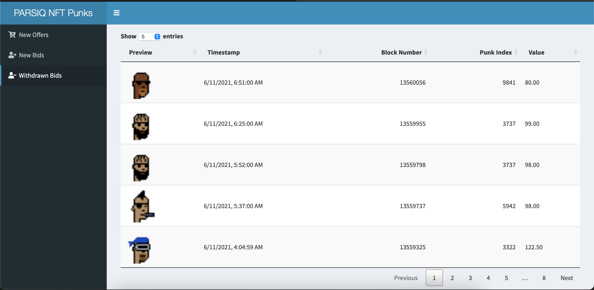

# PARSIQ CryptoPunks Offers and Bids Tracking Dashboard
We created three PARSIQ Platform Smart Triggers that respond to CryptoPunks directly related on-chain events and follow custom logic to deliver all necessary transaction information about the price action. On top of that we created a Web App to present the information to End User in Real Time.

## [App Walkthrough on YouTube](https://www.youtube.com/watch?v=D9sDKhzPo24) <<< Click Here
## [App Walkthrough on Blog](https://dspyt.com/generating-fast-and-easy-parsiq-triggers-for-cryptopunks) <<< Click Here
## [The Link to the project on PARSIQ](https://portal.parsiq.net/monitoring/projects/6ba2e00f-813c-4f5c-bf36-c5d53cbd7791/triggers)

Offers for Sale of the limited CryptoPunks collection are particularly vital to traders and collectors. New listings might prove to be an opportunity to profit from the immediate purchase. Meanwhile for traders new sales provide indicators for the demand/supply within the collections as well as for the market, in general.

## Start the App

- Start the app using `shiny::runApp()` in R console after setting the project directory as working directory

## Using the App
- In the Left Panel we can select Offers, Bids and Withdran Bids and see the updates in Real Time as soon as they appear on blockchain, The backend of the App is PARSIQ Smart Trigger pushing the data to Google Sheets.

- Offers

- Bids

- Withdrawn Bids

## About Cryptopunks
Cryptopunks is the NFT collection of 10000 uniquely generated characters. The collection has a highest market capitalisation and market volume as of Novemeber 4th 2021. 

